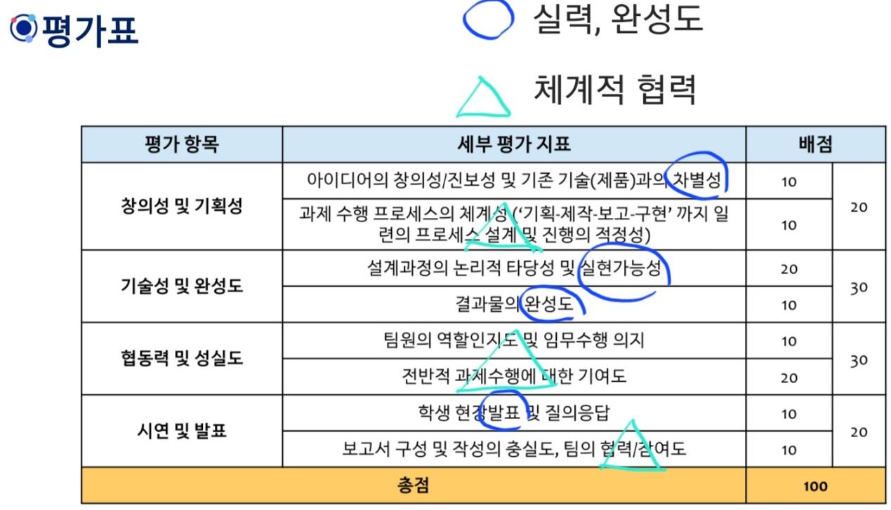

# 평가기준 / 제안할 것 - 박김한결

### 평가 기준

평가표 기준으로 **실력, 완성도**와 ****얼마나 **체계적으로 협동이 이루어졌는가** 가 핵심
결과물의 ‘완성도’로 나머지를 가늠할 수 있기 때문에 **완성도**가 가장 중요하다고도 볼 수 있음

- 평가표
    
    
    

+스토리텔링이 되면 좋다.

## 제안

- **발표시 - 프로젝트 과정 (여정) 전달 형식으로 발표**
    
    ex) 주제 선정 과정 설명 → 기획 과정 설명 → 개발 과정 (개발 과정에서 생긴 문제 및 해결 과정) 설명 → 마무리 및 보고서 작성 과정 설명
    TA님이 스토리텔링 위주로 풀어가면 좋다고 하셨고,
    우리가 노력한 걸 가장 명확하고 많이 전달할 수 있는 방식이라고 생각함
    
- 프로젝트 진행 과정 뭐든 많이 남기기
(**주간 회의 인증 사진 촬영**, **프로젝트 실행 과정에서 발생한 애로사항**, **이 노션 페이지** 등등등)
- 발표 자료 만들 사람 정하기
- 보고서 형식 봐서 스토리텔링 요소 가미 고려

저게 구체적으로 뭔지, 왜 저렇게 판단했는지 길게는 안적었습니다. 궁금한 거 있으시면 질문 주세요.

 다음 회의때 기회되면 더 설명해볼게여